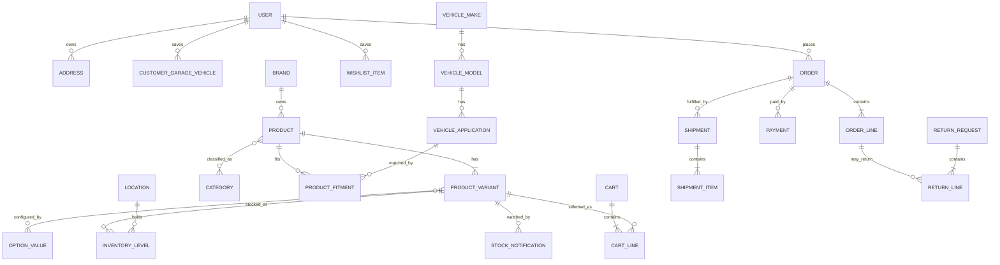

# Adventures Moto — Database Discovery Audit

**Audit date:** 27 July 2026  
**Reference site:** [adventuremoto.com.au](https://www.adventuremoto.com.au/)  
**Target application:** Adventures Moto (Next.js, MySQL, hosted on Hostinger)

## 1. Purpose

This audit identifies the data domains required to rebuild the important commerce
capabilities of the reference site without copying its implementation or carrying
its legacy structure into the new application.

It is a discovery document, not the final database schema. It should be used to:

- decide what data must be obtained before migration;
- agree on business rules that cannot be inferred from the public website;
- design the first ERD and Prisma schema;
- define the future dashboard modules;
- prevent product, fitment and order data from being modelled too narrowly.

## 2. Method and limitations

The audit used:

- the public website, navigation, category and brand pages;
- representative simple, configurable and bike-specific product pages;
- the public blog, FAQs, policies and terms;
- publicly visible account, garage, cart, stock and shipping behaviour;
- the taxonomy already captured in this repository's header data.

The public site reports more than **8,000 products, 200 brands and 150,000
fitments** on its [About page](https://www.adventuremoto.com.au/about-us/).

This audit does **not** have access to the current store's database, admin panel,
supplier feeds, warehouse system, payment dashboard, analytics or customer data.
Anything that depends on those systems is marked as a decision or inference rather
than a verified fact.

### Evidence confidence

| Confidence | Meaning |
| --- | --- |
| Verified | Visible on a current public page or policy |
| Strong inference | Required to implement an observed behaviour correctly |
| Decision required | Depends on private operational or commercial information |

## 3. Current repository state

The current Next.js application is a presentation prototype rather than a
data-backed store:

- navigation, brands, motorcycles, hero slides and homepage cards are local
  TypeScript arrays;
- the make/model/year selector uses a small sample list and generated years;
- account state is a client-side boolean and the forms are UI-only;
- there is no ORM, database client, API layer, payment integration or inventory
  source;
- the homepage and brand directory are the only implemented public pages;
- category links and most customer actions are placeholders for future routes.

This is a good point to introduce the data layer because there is little production
logic to unwind. The local arrays should later become reviewed seed/import data,
not parallel sources of truth.

## 4. Executive findings

1. **This is a variant-led catalogue.** A product can have combinations such as
   colour, size, length or lens, with each combination carrying its own identifiers,
   stock state, image and potentially its own price.
2. **Fitment is a core domain, not a product attribute.** Bike-specific products
   need many-to-many mappings to makes, models and applicable years or year ranges.
3. **Categories are hierarchical and products can belong to several branches.**
   The same concept appears in more than one shopping context, such as fuel tanks,
   heated grips and luggage racks.
4. **Inventory and fulfilment need location-level modelling.** The site refers to
   a main warehouse, physical showrooms, third-party warehouses, custom-built items,
   split consignments and dangerous-goods shipments.
5. **A product's sellability is more nuanced than in stock/out of stock.** Observed
   states include in stock, out of stock, preorder, backorder, special order,
   custom/order-in and variant-specific stock notification.
6. **Orders need immutable snapshots.** Product titles, SKU, selected options,
   prices, taxes, discounts and addresses must be copied onto the order so later
   catalogue changes do not rewrite order history.
7. **The existing taxonomy and URLs contain legacy inconsistencies.** We should
   migrate data into a clean canonical hierarchy and preserve old URLs through a
   redirect table, rather than encoding old paths into the new model.
8. **The dashboard is part of the database design.** Product maintenance, fitment,
   stock, orders, returns, content, promotions and audit history all require
   back-office workflows and roles.

## 5. Public feature inventory

### 5.1 Catalogue and merchandising

Observed catalogue capabilities:

- hierarchical product navigation;
- brand directory with alphabetical filtering;
- brand landing pages with logo, copy, category shortcuts and product listings;
- category and vehicle-specific landing pages;
- product listing filters, sorting and pagination/show-more behaviour;
- new-arrival, sale, featured-brand and top-product collections;
- product cards with price or “from” price, availability and badges;
- rich product descriptions, specifications and feature sections;
- product galleries and variant-specific media;
- manuals, brochures, size charts and other downloadable files;
- related, recommended and “others also bought” product groups;
- reviews and review submission;
- shipping calculation from quantity and postcode;
- back-in-stock notifications for a selected variant.

Representative evidence:

- [All products and navigation](https://www.adventuremoto.com.au/all-products/)
- [Brands directory](https://www.adventuremoto.com.au/brands/)
- [Rotopax brand landing page](https://www.adventuremoto.com.au/brand/rotopax/)
- [Simple product with physical specifications](https://www.adventuremoto.com.au/rk-clip-link-gb520xmo-gold)
- [Bike-specific product with manual and fitment](https://www.adventuremoto.com.au/shad-top-box-rack-for-honda-crf1100l-2020)

### 5.2 Primary taxonomy

The navigation currently groups the catalogue as follows:

| Root | Main groups observed |
| --- | --- |
| Riding Gear | Men's, Women's, Riding Protection, Riding Gear Bundles |
| Parts | Bike Protection, Brakes, Body, Cables, Chains & Sprockets, Controls, Electrical, Exhaust, Filters, Wheels, Fuel, Seats, Suspension |
| Luggage | Motorcycle Luggage, Luggage Accessories, Rider Luggage |
| Accessories | Security, Oils & Lubricants, Cleaning Products, Fuel Systems, Communication & Navigation, Electrical, Stands |
| Tyres | Front Tyres, Rear Tyres, Tyre Sets/Tubes, featured tyre brands |
| Tools | Tyre & Wheel, Engine, Suspension, Drivetrain and Hand Tools |
| Merchandising | Brands, New Products, Sale |

The full child-level navigation currently captured in the application should become
seed data only after the hierarchy is reviewed. It should not remain hard-coded in
the header.

Important normalization issues:

- categories such as Fuel Tanks, Heated Grips, Indicators, Horns and Luggage Racks
  appear in multiple shopping contexts;
- similar or historical route names coexist;
- category labels and URL paths are not always consistent;
- some brand and vehicle landing pages act as category pages;
- tyre sets appear publicly even though the current local header only lists front
  tyres, rear tyres and tubes.

Recommended treatment:

- one canonical `Category` hierarchy;
- a many-to-many `ProductCategory` assignment;
- separate navigation/menu configuration from the category hierarchy;
- optional category aliases for discovery;
- a `Redirect` record for every retained legacy URL;
- curated collections for “Sale”, “New”, “Featured” and campaign pages instead of
  pretending they are ordinary product categories.

### 5.3 Brands

A brand is more than a text label on a product. Public pages imply:

- canonical name and slug;
- logo and alternate logo;
- short and long descriptions;
- SEO title and description;
- banner/hero media;
- category shortcuts;
- featured state and display order;
- publish state;
- associated products;
- old slugs and redirects.

Brand data in the current repository is suitable as presentation seed data, but
must be reconciled against a source export before it becomes authoritative.

### 5.4 Products and variants

The minimum product/variant separation is:

#### Product (shared merchandising record)

- name, slug, subtitle and product family/code;
- brand;
- short and rich descriptions;
- structured content blocks such as benefits, construction, armour and fitment;
- categories and tags;
- default media;
- product type and publication status;
- tax class;
- flags such as dangerous goods, size-fit guarantee, custom made or special order;
- SEO metadata and canonical URL;
- related downloads and content;
- related-product relationships.

#### Variant (sellable item)

- SKU;
- MPN/manufacturer part number;
- supplier SKU;
- barcode/GTIN;
- selected option values;
- price, compare-at/RRP and cost;
- weight and packed dimensions;
- inventory and availability state;
- preorder release/ETA;
- backorder/special-order settings;
- variant image(s);
- active/published state.

Option structures must be data-driven. Observed examples include:

- size;
- colour;
- garment length;
- lens;
- bike/application selection.

Do not create fixed `size` and `colour` columns on `ProductVariant`. Use
`OptionDefinition`, `OptionValue` and `VariantOptionValue` so future option types
do not require schema changes.

### 5.5 Product content and attributes

The catalogue contains both prose and comparable data. We need both:

- rich content blocks for editorial descriptions;
- normalized attribute definitions and values for filtering/comparison;
- reusable size/fit guides;
- product documents such as manuals, brochures and certificates;
- typed product relationships: related, accessory, replacement, cross-sell,
  upsell and frequently bought together;
- badges such as sale, preorder, new, size-fit guarantee and dangerous goods.

Attribute definitions should support:

- text, number, boolean and enumerated values;
- units;
- category-specific applicability;
- filterable and comparable flags;
- display grouping and order.

### 5.6 Motorcycle fitment and My Garage

Observed user flow:

1. select motorcycle make;
2. select a model;
3. select a year;
4. browse products compatible with that motorcycle;
5. optionally save the motorcycle to an authenticated account.

Public vehicle pages also combine vehicle and product category, for example a
specific model's air filters. A fitment entry may represent a single year or a
range, and its product copy may include exceptions that cannot be represented by
year alone.

Recommended fitment model:

- `VehicleMake`
- `VehicleModel`
- `VehicleApplication`
  - model
  - start year / end year
  - trim, generation, engine or market where needed
  - display name and slug
- `ProductFitment`
  - product or variant
  - vehicle application
  - fitment note
  - exclusions
  - source
  - verification status and verified date
- `CustomerGarageVehicle`
  - user
  - vehicle application
  - nickname/default selection

Fitment should normally attach to the product, but the model must allow a
variant-level override where only one variant fits an application.

Examples:

- [BMW vehicle selection](https://www.adventuremoto.com.au/bike/bmw/)
- [KTM 890 Adventure R air filters](https://www.adventuremoto.com.au/bike/KTM-890-Adventure-R-Air-Filters/)
- [Honda CRF1100L product fitment](https://www.adventuremoto.com.au/shad-top-box-rack-for-honda-crf1100l-2020)

### 5.7 Search and product discovery

Required search inputs:

- product name and subtitle;
- SKU, MPN, supplier SKU and barcode;
- brand;
- categories and aliases;
- vehicle make/model/year;
- attributes and tags;
- editorial keywords.

At the expected initial scale, MySQL full-text/search queries can support an MVP,
but the data model should allow a later dedicated search index without changing
the source of truth. Search documents should be generated from normalized records,
not stored as the only copy of catalogue data.

### 5.8 Customer accounts and access

Account capabilities implied by the site and current UI:

- credentials and social sign-in identities;
- email/phone verification and password recovery;
- profile and saved contact details;
- multiple addresses;
- order history and tracking;
- wishlist;
- saved garage vehicles;
- stock notifications;
- store credit, vouchers or rewards;
- communication preferences and consent history;
- privacy access/correction/deletion requests.

The [Privacy Policy](https://www.adventuremoto.com.au/privacy-policy) explicitly
mentions contact information, postcode, interests, bike preference, marketing
choice and requests to correct or delete personal data.

Recommended access boundary:

- anonymous users can search, filter by motorcycle, browse products and calculate
  shipping;
- saving a garage vehicle, persistent wishlist, profile, order history, rewards and
  privacy controls requires an account;
- cart/checkout behaviour still needs a business decision. A guest cart with
  account merge is the lower-friction standard, but the team previously considered
  an account-gated cart. The schema can support either by allowing a cart to belong
  to a user or an anonymous session token.

### 5.9 Cart, checkout and orders

Core records:

- cart and cart lines;
- checkout session;
- customer and address snapshots;
- order and order lines;
- totals and adjustments;
- payment attempts, captures, refunds and provider references;
- order status history;
- staff notes and customer notes;
- shipment/consignment and tracking;
- returns/RMAs and return lines.

Cart/order pricing must preserve:

- unit price;
- compare-at price where relevant;
- discount allocation;
- promotion/coupon reference;
- tax amount;
- shipping allocation;
- store-credit/gift-card allocation;
- final line and order totals.

The terms state that timed deal prices can expire while an item is still in the
cart, so checkout must recalculate prices before payment. See the
[Website Terms of Use](https://www.adventuremoto.com.au/terms-of-use/).

### 5.10 Inventory, suppliers and fulfilment

Observed operational requirements:

- main warehouse fulfilment;
- two retail showrooms;
- third-party warehouse/drop-ship products;
- custom wheel sets or made-to-order items;
- dangerous-goods handling;
- bulky items;
- same-day dispatch cut-off;
- split shipments/consignments;
- carrier tracking;
- postcode- and weight-based express quotes;
- flat-rate standard Australian shipping;
- New Zealand and special-region rules.

The [Shipping Policy](https://www.adventuremoto.com.au/shipping-policy/) names
Australia Post eParcel, StarTrack Express and Couriers Please, and documents
separate dangerous-goods consignments and third-party warehouses.

Recommended inventory model:

- `Location` for warehouse, store, supplier or virtual/drop-ship location;
- `InventoryLevel` per variant and location;
- `InventoryMovement` append-only ledger;
- quantity on hand, allocated/reserved and available;
- reorder point and optional incoming quantity/ETA;
- `Supplier` and `SupplierProduct`;
- optional purchase orders and receipts when the dashboard reaches that phase.

Avoid storing only a mutable `stockQuantity` on the product. At minimum, inventory
belongs to the variant; for reliable multi-location operation it belongs to the
variant-location pair.

### 5.11 Availability and stock notifications

Suggested normalized availability state:

- `IN_STOCK`
- `LOW_STOCK`
- `OUT_OF_STOCK`
- `PREORDER`
- `BACKORDER`
- `SPECIAL_ORDER`
- `CUSTOM_MADE`
- `DISCONTINUED`
- `UNAVAILABLE`

The state should be derived from inventory and sale policy where possible, with
explicit override fields for preorder, special-order and discontinued products.

Stock notification subscriptions need:

- product variant;
- email and optional user;
- consent/source;
- created, confirmed, notified and cancelled timestamps;
- status;
- notification batch/event reference.

### 5.12 Shipping

Required concepts:

- shipping zones and countries/regions;
- methods and carriers;
- flat, table or provider-calculated rates;
- weight/dimension and postcode rules;
- signature/authority-to-leave option;
- product restrictions;
- dangerous-goods and international exclusions;
- packages/consignments;
- tracking number, URL and events;
- dispatch location;
- delivery instructions.

The rules should be configurable in the dashboard. They should not be buried in
checkout component code.

### 5.13 Promotions, coupons, credit and gift cards

Observed or documented behaviours:

- sale/deal start and end times;
- price revalidation after a deal expires;
- no additional discount on some deal items;
- customer store credit/reward balances;
- gift voucher number plus verification/secret code;
- partial redemption and balance;
- 36-month gift-card expiry;
- credits affected by returns;
- account- and purchase-based promotions or competition entries;
- featured/new/sale merchandising collections.

Recommended separation:

- `PriceList`/base variant prices;
- `Promotion` and `PromotionRule`;
- `PromotionAction`;
- `Coupon`;
- `OrderAdjustment`;
- `GiftCard` and append-only `GiftCardTransaction`;
- `CustomerCreditAccount` and append-only `CreditTransaction`;
- optional `Campaign` and `CampaignEntry`.

Balances must be derived from transactions or protected by a corresponding ledger;
do not make a single editable balance the only financial record.

### 5.14 Returns, exchanges and warranty

The [Returns Policy](https://www.adventuremoto.com.au/returns-policy/) documents:

- a 60-day return window;
- authorization and an RMA number;
- refund or store-credit outcomes;
- prepaid label costs deducted from refund/credit;
- item-condition checks;
- category/product return restrictions;
- size-fit guarantee eligibility;
- faulty and damaged-in-transit claims with images;
- manufacturer assessment;
- dangerous-goods restrictions;
- returned-to-sender handling.

Required records:

- return request/RMA;
- return lines linked to order lines;
- reason and requested resolution;
- condition and inspection result;
- customer evidence/media;
- return shipment/label;
- approval and status history;
- refund, replacement order or store-credit transaction;
- warranty/manufacturer assessment.

“Exchange” should normally be represented as a return plus a new/replacement order,
which matches the public policy and keeps financial history clear.

### 5.15 Reviews

Review data should include:

- product and optional variant;
- customer and order-line link for verified-purchase status;
- display name;
- rating;
- title and body;
- moderation status and staff response;
- submitted, published and updated timestamps;
- abuse/report state.

### 5.16 Content management and support

Observed content types:

- homepage hero slides and promotional sections;
- reusable navigation and footer content;
- brand and category landing copy;
- blog categories and posts;
- authors;
- FAQ entries;
- policy and general information pages;
- store/location pages and temporary notices;
- downloadable manuals, brochures, size guides and event PDFs;
- campaign/event pages;
- contact/help requests and live-chat integration.

The [Blog](https://www.adventuremoto.com.au/blog/) includes How To & Advice, Events
& Promotions, Buying Guides, Product Guides & Reviews and Rider Stories. Posts
carry author, date, excerpt, featured image and sometimes reading time or a
recommended flag.

Content requirements:

- draft, scheduled and published states;
- revision/audit history;
- SEO and social metadata;
- reusable media library;
- relations from content to products, categories, brands and vehicles;
- scheduling and display order for homepage placements.

### 5.17 Locations and business information

The public site exposes two showrooms, Sydney/Dural and Brisbane/Eagle Farm, with
different hours, phone numbers and temporary closure notices. The shipping policy
also refers to a Gold Coast warehouse.

Model locations rather than hard-coding footer copy:

- type: store, warehouse, supplier/drop-ship;
- address and geolocation;
- contact details;
- weekly opening hours;
- holiday/special hours and closure notices;
- pickup/fulfilment capabilities;
- active/published state.

## 6. Preliminary domain inventory

This is the expected entity inventory for the first ERD. Names can change during
schema design.

### Identity and authorization

- User
- AuthAccount
- Session
- VerificationToken
- PasswordResetToken
- Role
- Permission
- UserRole
- Address
- ConsentEvent
- PrivacyRequest

### Catalogue

- Brand
- Category
- CategoryClosure or materialized path support
- Product
- ProductVariant
- OptionDefinition
- OptionValue
- VariantOptionValue
- AttributeDefinition
- AttributeValue
- ProductCategory
- ProductTag
- ProductRelationship
- ProductDocument
- MediaAsset
- MediaAssignment
- Redirect
- Collection
- CollectionProduct

### Vehicle fitment

- VehicleMake
- VehicleModel
- VehicleApplication
- ProductFitment
- CustomerGarageVehicle

### Inventory and procurement

- Location
- InventoryLevel
- InventoryMovement
- Supplier
- SupplierProduct
- PurchaseOrder (later phase)
- PurchaseOrderLine (later phase)
- StockReceipt (later phase)
- StockNotificationSubscription

### Commerce

- Cart
- CartLine
- CheckoutSession
- Order
- OrderLine
- OrderAddress
- OrderAdjustment
- OrderStatusEvent
- Payment
- PaymentTransaction
- Refund
- Shipment
- ShipmentItem
- TrackingEvent
- ShippingZone
- ShippingMethod
- ShippingRule
- TaxClass
- TaxRate

### Customer engagement

- Wishlist
- WishlistItem
- Review
- Promotion
- PromotionRule
- PromotionAction
- Coupon
- GiftCard
- GiftCardTransaction
- CustomerCreditAccount
- CreditTransaction
- Campaign
- CampaignEntry

### Service and content

- ReturnRequest
- ReturnLine
- ReturnStatusEvent
- WarrantyAssessment
- ContentPage
- ContentRevision
- BlogPost
- BlogCategory
- Author
- Faq
- HeroSlide
- NavigationMenu
- NavigationItem
- StoreNotice
- ContactRequest

### Administration

- StaffProfile
- AuditLog
- ImportJob
- ImportRowError
- WebhookEvent
- ScheduledJob

## 7. High-level relationship map

This is deliberately high level. Promotions, content, ledgers, role permissions
and audit records are omitted from the diagram for readability.

## 8. State histories that must not be overwritten

Use current-status columns for fast reads **and** append-only event/history records
for important transitions.

| Domain | Example states |
| --- | --- |
| Product | draft, active, archived |
| Variant | active, unavailable, discontinued |
| Order | pending, placed, accepted, on hold, partially fulfilled, fulfilled, cancelled, completed |
| Payment | initiated, authorized, captured, failed, partially refunded, refunded, voided |
| Shipment | pending, packed, dispatched, delivered, returned, lost |
| Return | requested, approved, label issued, received, inspected, rejected, refunded, credited, replaced, closed |
| Review | pending, published, rejected, hidden |
| Content | draft, scheduled, published, archived |
| Import | queued, running, completed, completed with errors, failed |

## 9. Data storage boundaries

### Store in MySQL

- normalized catalogue, fitment and commerce records;
- file metadata and relationships;
- prices, inventory and ledgers;
- customer, consent and order data;
- CMS metadata and rich-text/block JSON where appropriate;
- audit, import and webhook records.

### Store in object/file storage

- product and brand images;
- videos;
- PDFs/manuals/brochures;
- return evidence uploads;
- generated exports.

MySQL should store the asset key/URL, metadata, checksum, ownership and usage—not
the image or PDF binary itself.

### Keep in environment/configuration

- database credentials;
- OAuth and payment provider secrets;
- email provider credentials;
- encryption keys;
- provider webhook secrets.

Secrets must never be stored in ordinary database records or committed files.

## 10. Migration and source-data requirements

The public website is useful for discovery but should not be treated as the primary
migration source. Before schema implementation, request the following from the
current business/platform:

1. category export including IDs, parent IDs, names, slugs and publish state;
2. brand export including descriptions and media references;
3. product and variant export with all identifiers and option combinations;
4. prices, RRP/compare-at values, tax classes and cost where permitted;
5. inventory by SKU and location;
6. product-category, product-brand and product-related-product mappings;
7. complete vehicle make/model/year and product-fitment mappings;
8. media and document manifest with original filenames and ownership;
9. supplier and supplier-SKU data;
10. customer, address and consent export, subject to privacy/legal approval;
11. orders, order lines, payments, shipments, tracking, refunds and returns;
12. gift-card/store-credit balances **and their transaction histories**;
13. reviews and moderation states;
14. blog, FAQ, policy and landing-page content;
15. redirects, canonical URLs and sitemap exports;
16. active promotions, coupons and scheduled campaigns;
17. location, shipping and tax configuration.

For every export, obtain:

- data dictionary;
- source primary key;
- timestamp and timezone;
- encoding and delimiter;
- deleted/archived indicator;
- authoritative owner;
- expected row count;
- incremental-update method for launch cutover.

## 11. Data-quality and migration risks

| Risk | Why it matters | Treatment |
| --- | --- | --- |
| Duplicate/overlapping categories | Creates inconsistent navigation and filters | Define canonical hierarchy and many-to-many assignments |
| Legacy/alternate URLs | Losing them damages SEO and bookmarks | Import redirect map and monitor 404s |
| Product vs variant identifiers | Wrong level causes stock and order errors | Profile identifiers by SKU and parent product |
| Free-text fitment | Cannot reliably power My Garage | Normalize and retain notes/exclusions |
| Variant-specific images/stock | Product-level data shows wrong availability | Map media and inventory to variants |
| Stale public information | Phone numbers, locations and policies have changed over time | Prefer current source exports and content owner review |
| Missing supplier ownership/licensing | Assets and copy may not be transferable | Confirm content and media rights |
| Inconsistent units | Shipping and filters fail | Normalize units while retaining raw source |
| Financial balances without ledgers | Cannot audit refunds, credit or vouchers | Migrate transaction history and reconcile totals |
| Customer consent ambiguity | Creates legal and marketing risk | Import consent source/time or default safely |
| Search-index gaps | Products become undiscoverable after migration | Generate index from canonical data and test queries |
| Cutover stock drift | Can oversell during launch | Plan freeze or incremental delta import |

## 12. Decisions still required

These cannot be safely answered from the public site:

1. What system is the source of truth today: current e-commerce platform, ERP,
   warehouse system, supplier feed or a combination?
2. Will Adventures Moto own inventory for one warehouse, multiple stores, or all
   locations?
3. Is click-and-collect required at launch?
4. Will guest checkout be allowed?
5. Which payment providers and buy-now-pay-later services are required?
6. Is pricing tax-inclusive, and are overseas sales part of the launch scope?
7. Are layby, quote, gift-card, store-credit and rewards workflows launch
   requirements or later phases?
8. Which shipping integration will quote rates and create labels?
9. Are supplier feeds available, and how often must price/stock sync?
10. Who owns fitment verification, and what confidence/source fields are required?
11. Will the dashboard replace all current administration or coexist with another
    inventory/accounting system?
12. How much historical customer/order data must be migrated?
13. Which existing URLs must be retained exactly?
14. What are the data-retention and account-deletion rules for Australian privacy
    compliance and financial records?
15. Is a single legal entity/storefront sufficient, or should the schema support
    multiple sales channels?

## 13. Recommended first implementation step

The next step should **not** be creating tables from the public site alone.

Request a read-only admin walkthrough and representative exports from the current
store. The first sample should contain roughly 30–50 products chosen across:

- a simple one-SKU product;
- apparel with size/colour/length variants;
- a helmet or goggle with variant media;
- a tyre;
- a bike-specific hard part with many fitments;
- a dangerous-good product;
- a preorder/backorder item;
- a custom or drop-shipped product;
- a gift voucher;
- a discontinued product with a replacement.

Then:

1. profile those exports and identify actual keys, nulls and inconsistencies;
2. agree on the canonical taxonomy and product/variant boundary;
3. build the ERD and data dictionary;
4. create the Prisma/MySQL schema and migrations;
5. write repeatable importers with dry-run/error reporting;
6. validate the sample catalogue end to end before bulk migration.

## 14. Proposed delivery phases

### Phase A — Foundation

- users/auth/roles;
- brands, categories, products, variants and media;
- motorcycle fitment and garage;
- location-based inventory;
- dashboard catalogue/import basics;
- URL redirects and SEO metadata.

### Phase B — Selling

- search/filter;
- cart and checkout;
- payments;
- shipping;
- orders, shipments and notifications;
- guest/account cart decision implemented.

### Phase C — Service and merchandising

- returns/RMA and refunds;
- reviews and stock alerts;
- promotions/coupons;
- CMS, blog, FAQs and homepage placements;
- gift cards/store credit if in scope.

### Phase D — Operational maturity

- supplier feeds and purchasing;
- advanced reporting;
- automated fitment QA;
- search service if MySQL search is insufficient;
- campaign/competition and rewards capabilities.

## 15. Audit conclusion

MySQL is a suitable source of truth for this application, including on Hostinger,
provided the hosting plan supports the required Node.js runtime and expected
connection/load profile. The biggest database risk is not MySQL—it is beginning
from an incomplete catalogue export or oversimplifying variants, fitment and
inventory.

The schema should therefore be designed from both:

1. the functional requirements documented here; and
2. the actual source exports and operational ownership of the current data.

Once those sample exports are available, this audit can be converted into a
concrete ERD, field-level data dictionary and migration plan.
