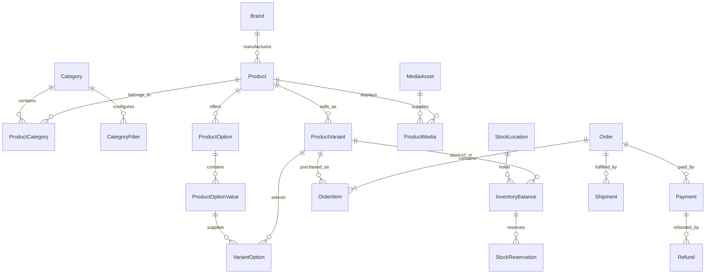

# Adventures Moto database design

This is the schema design for the store, product details and future admin system.
The executable definition is `prisma/schema.prisma`; ordered migrations live in
`prisma/migrations`. It extends the original foundation without dropping its data.
This document supersedes the original foundation dictionary where they overlap.

## What the screenshots require

| Screen data / behaviour | Storage |
| --- | --- |
| Product title, route, brand, publication and SEO | Product, Brand |
| Card price and crossed-out price | Product defaults; optional ProductVariant overrides |
| Main image, ordered thumbnails, alternate views | ProductMedia → MediaAsset; lowest displayOrder image is the cover |
| SKU, barcode, size, length, colour | ProductVariant + ProductOption + ProductOptionValue + VariantOption |
| Available sizes and crossed-out unavailable options | Active variant selections + InventoryBalance |
| Brand, stock and price filters | CategoryFilter built-in kinds |
| Size filters only on appropriate categories | CategoryFilter OPTION entries referencing size definitions |
| Other filterable characteristics, e.g. material, tyre width | AttributeDefinition, AttributeValue, ProductAttribute |
| Full description and construction/features lists | Product.description, ordered ProductSection body/bullets |
| Video / walkthrough | ProductSection.videoUrl or video MediaAsset |
| Size chart and measuring guidance | Reusable SizeChart |
| Shipping, returns, warranty | Reusable StorePolicy assigned to products |
| “Available in other colours” | ProductRelation with COLOUR_ALTERNATIVE |
| “Don't forget the essentials” | ProductRelation with ESSENTIAL |
| Online, Sydney and Brisbane availability | StockLocation + InventoryBalance per SKU/location |
| Reviews and moderation | Review with PENDING / APPROVED / REJECTED state |
| “Was this page helpful?” | ProductFeedback, one vote per product/hashed visitor key |
| Wishlist | WishlistItem linked to customer/product |
| My Garage and compatible parts | MotorcycleMake → Model → Year, ProductFitment, CustomerMotorcycle |
| Cart and quantity | Cart, CartItem referencing the exact SKU |
| Orders, payment, refunds and split shipments | Order, OrderItem, Payment, Refund, Shipment, ShipmentItem |
| Admin permissions and change history | User, Role, Permission, joins, AuditEvent |

Afterpay's payment schedule is not a product field. A future approved payment
integration computes eligibility and instalments from the current checkout price.
Guarantee badges should only be rendered from approved policy/content, not assumed
for every product. Delivery cutoff calculations belong to shipping services using
location timezone and business calendars, not a fixed product text claim.

## Core relationships

## Product versus variant

A product is a browsable page. A variant is the exact sellable SKU. A product with
no choices still gets one variant; do not create fake sizes for tools or luggage.

Example: a jacket page can offer size S/M/L and length regular/tall. Each valid
combination has a distinct SKU. `VariantOption` allows only one value per option
per variant, and composite foreign keys prevent selecting values from another
product. Different colours can be separate products with their own galleries and
COLOUR_ALTERNATIVE links, matching the screenshot. They can alternatively be
options on one product when that is the desired merchandising behaviour.

The admin service must generate `optionSignature` as a SHA-256 hex digest of the
sorted option/value IDs (or `default` for a no-option SKU), within the same
transaction as selections. Its unique product/signature constraint prevents
duplicate combinations. NULL is only for legacy migration records. Require a
complete selection of every option before publishing a variant.

`Product.primaryCategoryId` provides stable breadcrumbs; the admin must also add
that category to ProductCategory. A product can belong to multiple categories.
The category tree must be checked for cycles during edits. Do not infer category
identity from a display name. Slugs and SKUs are unique, including archived rows;
archive normally instead of deleting or recycling identifiers.

## Category filters

CategoryFilter rows are the complete filter configuration for that category.
Set explicit rows for every published category rather than relying on inheritance:

| Category | Suggested filter rows |
| --- | --- |
| Jackets / pants / helmets / boots | size (OPTION), brand, availability, price |
| Chain tools | brand, availability, price |
| Tyres | tyre-width / rim-size (OPTION or ATTRIBUTE), brand, availability, price |
| Luggage | capacity (ATTRIBUTE), brand, availability, price |

Built-in BRAND / AVAILABILITY / PRICE rows must have a NULL attributeId. OPTION
and ATTRIBUTE rows require one. Admin validation enforces this. isWearable controls
wearable-specific presentation; it does not turn every dimension into an adult size.
Attribute numeric values and units support numerical ranges without parsing labels.
Option codes must be consistent across products for facet aggregation; display
labels can differ. Facet counts count DISTINCT products, not SKU rows.

## Pricing, inventory and ordering rules

- All amounts are decimal, never float. Store currency as an ISO code; initial
  storefront supports AUD only. Product price is the base price, with nullable SKU
  price overrides. A SKU override uses its own compare-at price; otherwise both
  prices fall back to the product. A NULL compare-at means no sale, not zero.
- Cards show the minimum effective price among active variants, with “From” when
  prices differ. Selecting a SKU uses that SKU's effective price. Server checkout
  recalculates totals; never trust amounts submitted by the browser.
- Amounts are tax-inclusive. `Order.subtotal` is the sum of undiscounted line
  amounts; discountTotal includes all allocated discounts. grandTotal equals
  subtotal − discountTotal + shippingTotal. taxTotal is included tax, not added
  again. Allocate any order-level discount to lines so totals remain reconcilable.
- Available quantity is `max(0, onHand - reserved - safetyStock)`. Online stock
  considers only active locations with fulfillsOnline. Pickup uses offersPickup.
  Do not create an “online” balance that duplicates a store's physical stock.
- Reserve stock and create the pending order atomically. Use conditional updates
  checking sufficient availability and the inventory version; increment reserved
  and version together. StockReservation records the allocation and expiry.
- Payment confirmation, expiry and cancellation compete for the reservation.
  Transition only ACTIVE rows, once, in a transaction. Consuming decrements onHand
  and reserved and writes an InventoryMovement; releasing only decrements reserved.
  Retry transactions on deadlocks. Expiry needs a scheduled job; the schema alone
  does not run one.
- InventoryMovement is append-only and references a unique operation key. Change
  balances and write the movement in the same transaction. Initial stock needs a
  receipt movement, not a guessed conversion of the old inStock boolean.
- BundleComponent identifies exact component SKUs and quantities. Validate no
  self-reference/cycles, enforce a BUNDLE parent, and reserve component stock.
  Do not also decrement independent stock on virtual bundle parent variants.
- OrderItem retains purchased names, SKUs, options and amounts. Order retains
  addresses and policy snapshots. Catalogue edits must never rewrite these records.
  Foreign keys restrict deleting purchased SKUs, orders or payment history.
- Payment/checkout idempotency keys prevent duplicate operations. Only verified
  provider events may settle payments. Payment currency must match the order.
  Refunded totals must not exceed successful payments. Do not store card details.
- ShipmentItem composite keys prevent attaching another order's line. Services
  enforce that shipped/reserved totals never exceed line quantity and the reserved
  inventory belongs to the order item's SKU (or its validated bundle components).

## Media, content and reviews

Store files outside MySQL. MediaAsset keeps location, MIME type, dimensions, alt
text and checksum; ProductMedia supplies ordering and optional SKU assignment.
Archive a file only after checking its usages. Videos may reference an uploaded
file or an allowlisted provider URL; the rendering adapter must distinguish them.

Use JSON only for bounded documents: section bullet arrays, chart rows, address /
option / policy snapshots and audit diffs. Validate these against explicit input
schemas. Descriptions and bodies are plain text; any later rich-text format must
be defined and sanitized before rendering. No arbitrary HTML execution.

SizeChart.measurements: `{ "headings": ["Size", "Chest (cm)"],
"rows": [["S", "90–95"], ["M", "96–101"]] }`. These are format examples, not
measurements to publish. Validate rectangular rows and units before saving.

Only APPROVED reviews appear publicly or contribute to rating aggregates. Rating
is constrained to 1–5. One customer can edit their review per product. “Verified
purchase” is derived from that customer's paid order lines, never client input.
Record moderation actor and changes in AuditEvent. Feedback visitorHash should be
a salted hash of an opaque visitor token, not a raw IP address; rate limiting and
retention belong to the service.

## Admin and security boundaries

Example permission codes: `catalogue.read`, `catalogue.write`, `catalogue.publish`,
`inventory.adjust`, `orders.manage`, `reviews.moderate`, `users.manage`.
Roles group permissions; every server mutation checks them. A table is not an
authorization implementation. Use Product.version to reject stale admin edits.
Write AuditEvent alongside the mutation. Redact passwords, tokens and sensitive
payment data from changes. Normal admin access must not alter audit/movement rows.

User.passwordHash contains only a modern password hash. Account verification,
sessions, OAuth identities, password resets, MFA and saved address books will be
designed with the chosen authentication system; these are not implemented here.
Guest carts use hashed secrets and expire. A publicId is an identifier, not an
access token. Order addresses are immutable validated snapshots, not live profile
references. Retention/anonymisation must preserve required order records.

## What the database enforces versus the service

Foreign keys, uniqueness and indexes protect relationships and lookup paths.
Custom CHECK constraints enforce positive quantities, nonnegative prices, review
ratings, reserved <= onHand and internally consistent line/order totals. These
checks are in `20260910020000_commerce_constraints`, because Prisma cannot declare
them directly in its schema. They require an engine that actually enforces CHECK.

Cross-row rules require transactional service validation: complete option sets,
option signatures, primary-category membership, tree/bundle cycles, conditional
filter configuration, effective variant pricing, review eligibility, order sum /
currency consistency, reservation allocations, shipment limits and refund limits.
Direct phpMyAdmin edits bypass these service rules; normal catalogue work should
go through the future admin API.

Prisma guidance: [custom migration features](https://docs.prisma.io/docs/orm/prisma-migrate/workflows/unsupported-database-features)
and [transaction patterns](https://docs.prisma.io/docs/orm/v7/prisma-client/queries/transactions).

## Migration and Hostinger deployment

The new migrations add tables/columns and checks; they do not drop the old fields.
Before applying to a populated database, back up and check legacy prices for
negative values or compare-at values below price. Correct invalid data deliberately;
the migration should fail rather than silently rewrite it. Test on a restored copy.

Preferred deployment: configure credentials and run `prisma migrate deploy`,
then `prisma generate`. Use `.env.example` locally; no credentials are committed.
The current Docker definition is MariaDB 11.4.12. Confirm Hostinger's exact server
version/collation before selecting the local engine. Custom checks require MySQL
8.0.16+ or MariaDB 10.2.1+; an older engine is not an equivalent target.

For an EMPTY database in phpMyAdmin, run `node scripts/export-database-schema.mjs`
and import `prisma/exports/schema.sql` after selecting your database. The export is
schema only: it includes neither product data nor files. It does not create a
database or grant permissions. MySQL DDL is not an atomic all-or-nothing import;
if it fails, investigate before retrying into a partially created schema.

Use either the fresh SQL import or migration deploy for creation, not both.
If importing schema.sql, verify it matches this version, then baseline these
already-applied migrations using `prisma migrate resolve --applied <name>` for:

1. `20260728004153_catalogue_foundation`
2. `20260910000000_store_products`
3. `20260910010000_catalogue_and_commerce`
4. `20260910020000_commerce_constraints`

Do not mark a migration applied unless its SQL completed successfully. Subsequent
changes use new migrations. If moving a full local database dump instead, include
the `_prisma_migrations` table so its history moves too. Prisma's cuid and updatedAt
behaviour runs in the client: raw SQL inserts must supply those required values.

## Compatibility and next implementation work

This task establishes storage and migration design, not the admin/checkout APIs.
Existing storefront adapters still read imageUrl, variant.size, variant.inStock
and product-level prices. They remain intact to keep current pages compiling.
Do not start entering new-schema-only data through an admin until adapters switch.

Cutover sequence:

1. Import approved catalogue/media data and explicit category filter configuration.
2. Backfill primaryCategory, isWearable, option definitions/selections/signatures.
3. Import actual stock counts per location; never turn `inStock=true` into 1 item.
4. Switch card/detail/garage queries to normalized media, prices, options, filters,
   content and availability. Verify screenshot scenarios with fixtures.
5. Build validated transactional admin endpoints and role enforcement.
6. Remove legacy imageUrl, size and inStock in a separate migration after all reads
   and writes have migrated. Build checkout with payment/reservation integration.

Promotional coupons, gift cards, multi-currency conversion, return merchandise
authorisations and supplier purchasing are later modules. This schema provides
the catalogue and core ordering foundation without pretending those workflows
already exist.
